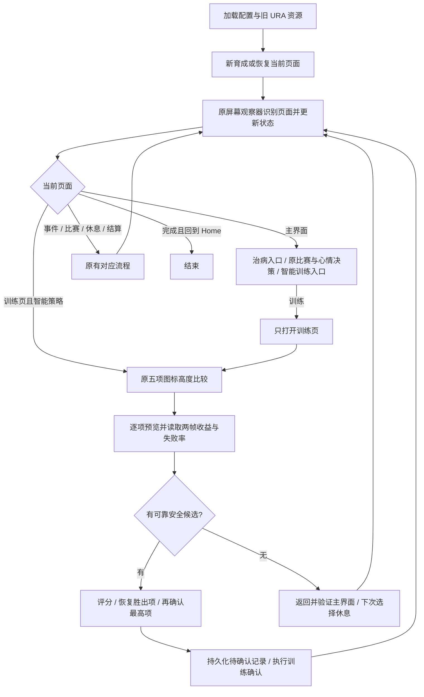

# URA 智能训练：完整运行流程与修复定位

日期：2026-10-06。按当前代码梳理，适用于普通 Career 的 `smart-balanced-safe`。
本文件解释现有实现，不改变策略规则；固定策略、比例策略和 Independent Training 继续走原流程。

## 1. 整体结构



运行循环是“观察页面 → 更新状态 → 分发当前页面动作 → 再观察”，不是预先盲点一串坐标。
打开训练页与真正执行训练是两个独立阶段；切换未选中的训练只用于预览。

## 2. 启动与状态来源

1. 读取角色、支援卡、继承、跑法、技能及策略配置，加载原 URA 页面与 JSON 执行资源。
2. 策略为 smart-balanced-safe 时创建 UraSmartTrainingStrategy，并为评分接入角色赛事数据库的距离查询。
3. 新育成沿用原入口、角色/支援/继承选择和开始确认；继续育成先识别当前检查点，沿用原恢复流程。
4. 继续育成时加载相同设备和角色的智能训练待确认记录；存在记录时恢复确认保护。新育成清除该角色旧记录。
5. 每轮沿用 CareerScreenObserver 与 UraScenarioModule：日期、心情、目标、倒计时使用旧 OCR 和解析器，体力使用旧能量条视觉检测。
6. 角色赛事数据库仅提供评分距离，不替换原 OCR 的目标推进。

关键状态：TurnIndex / TurnPositionLabel、CalendarStage、Energy、Mood、HasPendingRace、CurrentRaceId、ObservedGoalKind。
主界面观察到日期后，原连续比赛逻辑也会判断上一动作是否推进回合。

## 3. 主界面的实际决策顺序

进入主界面动作前，原运行循环先处理尚未结束的动作、事件和目标完成过渡。
CareerTurnFlow 还会等待继承 GO 事件，以及比赛后的目标完成过渡。

正常主界面按以下顺序处理：

1. **识别到可用治病入口**：CareerTurnFlow 直接执行治病入口，不先调用训练评分。
2. **此前五项扫描全部不可用的休息标志**：智能策略消耗 SmartTrainingFallbackPending，选择休息。
3. **原策略决策**：先判断完成状态，再处理待参加的比赛；连续两场比赛时，允许推迟的比赛先安排非比赛回合，必须现在参加的目标赛仍参加。体力低于 50 时直接休息，不进入五项预览，也不因低心情改成外出。体力达到 50 后，普通阶段心情为 Normal 或更低时选择外出；合宿阶段不套用这个普通阶段心情分支。
4. **准备训练时检查体力**：未知、来源 Unknown 或可信度低于 0.70，选择休息。
5. **Classic / Senior 六月下半月且体力低于 80**：选择休息准备合宿。此规则只在原策略本来选择训练时生效，不覆盖已选的比赛或外出。
6. **其他情况**：打开训练页，准备比较五项。智能策略休息阈值为 50；体力低于 50 已直接选择休息，等于 50 则通过这道门槛，仍需满足心情、合宿准备和体力可信度条件。
7. 最终动作必须在当前阶段的可用动作里；不可用则返回失败，不能假装已执行。
8. 休息时，CalendarStage 为 SummerCamp 则调用原合宿休息入口，其余调用普通休息入口。

主界面初次训练 TargetId 通常写 speed，这是打开训练页的占位值。**真正执行哪项由训练页五项评分决定。**
治病与必须参加的比赛保留原优先级；其他普通回合，体力低于 50 直接休息。

## 4. 五项预览与选中状态

### 共用原最高项规则

- 原 Training 标题与原 Back 按钮都匹配，才继续把此页当作可选择的训练页；成功结果页也可能保留 Training 标题。
- 用原五项图标模板，在各自普通与凸起区域的并集里做颜色匹配。
- 智能流程使用专用加速匹配器：预计算原 32×24 颜色采样点，以粗搜索建立误差上界，再逐像素搜索原完整区域；累计误差已不可能胜出的点提前结束计算。阈值、透明像素规则、最高分及同分位置保持原行为，固定/比例策略继续使用原匹配器。
- 五项匹配齐全后，比较图标 CenterY：**CenterY 最小，即画面最高的图标，就是当前选中项。**
- 没有新增各类型的选中模板，不需要先采集五种选中截图。
- 当前 SelectHighest 没有额外高度差门槛；相同高度按匹配列表顺序取第一个。动画中高度判断异常时，应先查五项匹配位置与时序。

### 扫描步骤

先扫描本帧已选中的项目，其余项目按速度 → 耐力 → 力量 → 根性 → 智力的原顺序补齐。无论从哪个项目恢复，都完整读取五项，正常只需四次预览切换；原评分和同分规则不受扫描顺序影响，前端仍按原五项顺序显示。

对每种训练：

1. 首次截图执行原五项高度比较；后续复用上一项第二帧的比较结果。已是目标项则不点击。
2. 不是目标项时，直接点击该比较结果中的目标图标中心，沿用原带日期保护的 TapMatchAsync；智能扫描不再另跑 flat-only ROI 的 preview JSON 匹配。
3. 切换后以 120 ms 间隔截帧、比较五项高度，最多检查三帧；只发一次预览点击。确认目标项最高的这张截图同时作为第一张收益帧。
4. 第一帧读取七个字段，同时等待 120 ms 后截第二帧、比较五项高度。第一帧 OCR 只访问已截取的图像；并行期间不发送点击。两个任务都完成后，才开始第二帧字段读取，避免缓存和证据互相覆盖；中断或失败也等待任务结束。
5. 第二帧按字段检查预处理后的数字图像是否逐像素相同；同一训练项、已知值、图像尺寸和像素全部相同才复用第一帧的 OCR。变化字段重新识别，未知值不复用。
6. 两帧对应字段都已知且相等，才保留稳定值；不一致或任一未知则该字段未知。仍然读取两张真实截图，并核对两帧选中项。
7. 将候选加入本轮列表；核心增益或失败率不可靠时，按运行/类型限额自动留证。

页面已切走就返回原观察循环。初次五项识别失败、预览点击失败、胜出项恢复失败等会返回失败；扫描中部分候选识别不到则排除该候选，仍可比较其他可靠候选。

## 5. 七个数值怎么读取

字段是五项属性增益、技能点增益、失败率。
辅助字段 TrainingLevel / UnbondedSupportCount / HintCount 在当前读取器里保持空。

- 六项增益共用同一属性栏的固定列位置，读取的是显示的“+增长”，不是当前属性总值。
- 失败率共用原纵向 ROI 和宽度，以本帧最高图标的横向中心定位气泡，适配气泡跟随选中项左右移动。
- 增益提取橙色字形连通块，去掉背景和左侧装饰箭头，恢复描边字亮色内部。
- 失败率提取白色或黄色字形，定位百分比所在末行；保留百分号下圆点，排除下方图标碎片。
- 蓝色失败率气泡先限制到气泡主体内，排除头发、衣服和 Duel 标记；不再用裁片中央 25%～75% 排除该主体中的字形，避免动画造成图标横向匹配偏移时漏掉 `%`。其他颜色继续沿用原提取路径，不能将未读到的百分比当成 0。
- 裁剪/缩放、Windows OCR、技能数字解析和本地 Tesseract 引擎继续复用既有实现；智能策略另有批量启动适配器，旧策略的共用执行器不改。
- 智能策略将需要识别的数字裁片放在互相隔开的图像行中，合为一次 Windows OCR；按返回文本框所在行归属字段，跨行文本不采用，不按文本返回顺序猜字段。
- 智能运行读取顺序：本地 Tesseract 合批 → 共用解析与字形校验 → 仅仍未解析的字段合批调用 Windows OCR。本次实际截图中原 Windows 先行识别几乎均为空，故不再每帧先付出该调用成本；Tesseract 不可用时仍保留 Windows 路径。各裁片作为独立图片页输入，按 TSV 的 page_num 映射字段；缺页不会造成后续字段错位。第二帧只重新识别像素变化或此前未知的字段。普通读取路径及注入回退测试仍保持原 Windows 优先顺序。
- 训练使用 2 倍放大；Tesseract 尝试 PSM 7 / 8 / 13。原倒计时仍用自己的 4 倍和 PSM 8 / 13。
- 智能运行路径每张已验证截图拥有独立、最多 5 秒的 Tesseract 批量回退预算：数字裁片一次启动读取，仅失败字段切换后续模式重试。常规成功就立即返回，不固定等待 5 秒；Windows OCR 不扣入该预算，它不是整项扫描总超时。该子进程独立设置 OMP_THREAD_LIMIT=1，避免小数字裁片启动多个计算线程争抢模拟器资源。普通读取路径及注入回退的旧测试仍保留原累计 2.5 秒预算。
- 增益允许 0～999，失败率允许 0～100；增益必须有可辨认的 +（兼容 * / #），失败率必须带 %。负数、多个不同数字、格式破损、越界保持未知。
- 智能增益额外核对清理后字形的横向分组：一组加号加上对应位数的数字。位数不符时不接受 Windows OCR 或 Tesseract 数值；Tesseract 继续尝试下一个原模式。没有截断数字或降低 999 上限，真实三位数字仍可通过。字形粘连等无法可靠核对的情况保持未知。
- 沿用 O/o→0、I/l→1 的纠错。
- 智能快速路径中，收益条确实存在、该列符合原视觉空栏规则、预处理裁片全白时，直接记 0 并跳过 OCR。普通读取路径仍要求 OCR 返回空文本和原空栏证据。OCR 异常或无响应不能直接变 0；失败率空文本也不能变 0%。
- 核心增益可信度与失败率可信度分别计算，评分要求二者都至少 0.80。

本轮候选不会跨回合或跨运行保存。图像识别复用仅在同一候选的第一、第二帧之间启用，下一候选和下一回合第一帧均重新识别。

## 6. 候选过滤与评分

先排除：

- 六项核心增益不完整或可信度低于 0.80。
- 失败率未知、越界或可信度低于 0.80。
- 失败率大于 5%（5% 可用，6% 排除）。
- 加权预计收益为 0。

距离来源：评分专用查询先找当前赛事，否则从已选角色的后续目标链中找可用赛事；查不到再用原 scenario 当前赛事，仍不明则使用中距离权重。该查询不修改目标状态。

| 距离 | 速度 | 耐力 | 力量 | 根性 | 智力 |
|---|---:|---:|---:|---:|---:|
| 短距离 | 1.4 | 0.5 | 1.0 | 0.3 | 0.8 |
| 英里 | 1.4 | 0.8 | 1.0 | 0.3 | 0.8 |
| 中距离 / 未知 | 1.4 | 1.2 | 1.0 | 0.3 | 0.8 |
| 长距离 | 1.4 | 1.6 | 1.0 | 0.3 | 0.8 |

```text
基础分 = (速度增长×速度权重 + 耐力增长×耐力权重
        + 力量增长×1.0 + 根性增长×0.3 + 智力增长×0.8
        + 技能点增长×0.5) × (1 - 失败率/100)

正常训练最终分 = 基础分
体力 < 50：主界面直接休息，不进入五项评分
```

权重、5% 门槛和体力 50 门槛目前在代码中定义，没有新增界面调参项。本版按当回合显示收益评分，没有再根据当前属性短板、属性封顶或未来多个回合做额外优化。评分接口原低体力智力 +15 暂保留兼容，但正常主界面流程已在低于 50 时休息，不触发该分支。

评分器保留羁绊与 Hint 的可选加分结构，但本版读取器返回空，因此运行中的两项加分为 0。
友情等提高的实际收益已经体现在“+增长”里，本版不再根据彩圈重复加分。

先取最终分最高者；同分取失败率更低者；仍相同则按速度 → 耐力 → 力量 → 智力 → 根性。
注意：这个同分顺序与五项扫描顺序不同。

例：中距离，速度候选 +20 速度 / +9 力量 / +5 技能点 / 0%，分数为 39.5；
智力候选 +4 速度 / +12 智力 / +5 技能点 / 0%，基础分 17.7。上述比较用于体力达到 50 且其他主界面条件允许训练时；体力 40 则直接休息，不进行这组比较。

## 7. 胜出项、休息与确认保护

### 有胜出项

1. 若胜出项已经选中，仍另截新帧比较五项高度；上一帧无法可靠识别时也先补截新帧。
2. 当前不是胜出项且上一帧比较已验证时，直接使用该图标位置切换，再在切换后的新帧进行五项比较及三帧有界检查；省掉切换前紧邻的一张重复截图。真正确认始终使用刚核对过的胜出项新帧。
3. 验证成功后设置 PendingTrainingType，标记训练动作并准备原目标完成探测。
4. **真正确认前**设置 TrainingTurnCommitPending / Type / TurnIndex，将待确认记录持久化到磁盘。
5. 角色身份缺失或记录保存失败时，不发送训练确认。
6. 刚验证的五项匹配齐全、赢家确实最高，且赢家匹配位于原 raised_click 搜索区域并满足原阈值时，复用该匹配及原 JSON 的缩放 clickOffset，通过带日期保护的 TapMatchAsync 确认一次，免去再次截图比较和 raised_probe / raised_click 的重复匹配。配置要求额外延迟或特殊动作、动画使匹配不在 raised 区域时，仍走旧确认链。
7. 点击成功返回后设置 TrainingClickIssuedType，并建立原连续比赛逻辑的动作基线；后续仍见训练页时只等待，不扫描、不再确认。页面切换交回原观察循环。输入中断或结果未知时保留已持久化记录，不补点。

“单次确认”指消费回合的训练确认；预览切换点击不计入确认次数。
确认前后依然存在观察、输入和游戏动画的时序，需设备运行验收。

### 无可用候选

1. 标记 SmartTrainingFallbackPending，清空胜出项。
2. 点击原 Back，最多五次以 180 ms 间隔检查主界面模板。
3. 主界面确实出现后，下一次主界面决策消耗该标志，选择普通或合宿休息。
4. Back 后未验证到主界面就返回失败，不能假装已休息。

### 已提交动作的结果与恢复

持久化文件：`%LOCALAPPDATA%/UmamusumeAss/debug/hachimi/career/smart-training-pending-<设备与角色摘要>.json`。
身份由 AndroidId、Serial、TraineeId 组成；记录角色、训练类型、提交回合和时间，不保存候选分数。

- 当前运行 TrainingClickIssuedType 已有值：不发第二次确认。
- 重启/继续育成加载到待确认记录，又遇到训练页：返回“上次确认结果未知”的失败，不重新扫描确认。
- 看见 training_result，或主界面满足当前提交完成判断时，清除内存确认标志，调用策略 ConfirmTraining 清空候选；运行循环随后清除磁盘记录。
- 当前主界面完成判断是 `PendingTurnAction != Training && (TurnIndex > 提交回合 || (TurnIndex == 提交回合 && 日期来源 == Observed))`。等回合分支用于支持原流程恢复，排查重复点击时须同时核对 PendingTurnAction / 日期来源，不能概括为“日期增加才清除”。
- 原连续比赛逻辑在出道前日期索引恒为 0 时，还会结合目标倒计时减少一回合判断动作推进。
- 记录损坏或不可读取会报错；不能当作“没有记录”继续。

## 8. 训练以外的流程

比赛选择、跑法、比赛执行、重试闹钟、事件选项、继承 GO、外出、治病、普通/合宿休息、技能学习及育成结算，继续由原模块处理。
智能评分只替换普通训练页选择项目的部分，不接管上述模块。
动作后的事件与 GOAL 页面仍先走原过渡流程，再开始下一回合。结算完成返回 Home 后结束并处理原技能缓存。

未知页面沿用原稳定识别重试与诊断；重试耗尽或动作失败时返回失败/暂停。
日期变化中断沿用原日期恢复机制，智能流程不吞掉这类异常。

## 9. 日志与修复入口

每项候选的日志含六项增长、失败率、距离、基础分、低体力智力加分、最终分或排除理由。
Hachimi 前端另以单条训练扫描日志卡显示本轮五项训练的全部六项增长、失败率、评分、排除原因和最终选择，并标注日期与体力。标题、字段、未知值、排除原因和选择说明均读取当前界面语言资源：英文设置显示“Smart training scan”，中文设置显示“智能训练扫描”；不根据操作系统或工作线程的语言猜测。每次生成新卡读取当前资源，切换语言后新卡立即跟随；缺失资源默认英文。胜出项在确认前标为待确认。该卡直接使用本轮扫描及评分结果，不额外截图或 OCR；原逐项详细诊断日志保留。
选中确认日志可见 Raised training item 及五项 y / 匹配分数。
没有安全候选时有明确休息回退日志；上次确认结果未知有独立失败信息。

字段未知或双帧不稳定时，已有帧保存到：

```text
%LOCALAPPDATA%/UmamusumeAss/debug/hachimi/career/
  smart-training-<运行时间与摘要>/<训练类型>/
    sample-1.png
    sample-2.png
    recognition.json
```

每次运行每种训练最多保存首次异常。高失败率本身不会触发“识别异常”留证；识别正确时在候选日志中记录排除。
JSON 包含日期/回合、两帧候选、合并值及字段识别证据。智能读取 RawText 包含 Windows OCR 文本以及各回退模式的 Tesseract 原始字段文本；Source 标明 visual-blank、windows-ocr、tesseract-batch 或 stable-pixels/来源。
初次无法识别五项或没有截到帧时，不一定有这组双帧文件，先查原页面诊断与日志。

| 症状 | 先看什么 | 修复入口 |
|---|---|---|
| 日期、心情、目标、体力不对 | 主界面观察值、状态来源/可信度、原页面诊断 | [CareerScreenObserver](C:/Users/Owner/Documents/teiocode/UmamusumeAss/UmamusumeAss/src/UmamusumeWpfGui/Services/Training/Runtime/CareerScreenObserver.cs) / [UraScenarioModule](C:/Users/Owner/Documents/teiocode/UmamusumeAss/UmamusumeAss/src/UmamusumeWpfGui/Services/Training/Scenarios/Ura/UraScenarioModule.cs) |
| 不该外出/休息/比赛却选了 | 高优先级分支、CalendarStage、SmartTrainingFallbackPending | [旧 UraDefaultStrategy](C:/Users/Owner/Documents/teiocode/UmamusumeAss/UmamusumeAss/src/UmamusumeWpfGui/Services/Training/Normal/SimpleNormalTrainingStrategy.cs) / [智能策略](C:/Users/Owner/Documents/teiocode/UmamusumeAss/UmamusumeAss/src/UmamusumeWpfGui/Services/Training/Normal/UraSmartTrainingStrategy.cs) / [CareerTurnFlow](C:/Users/Owner/Documents/teiocode/UmamusumeAss/UmamusumeAss/src/UmamusumeWpfGui/Services/Training/Runtime/Flows/CareerTurnFlow.cs) |
| 选中判断或切换错误 | 五个图标的 CenterY / 分数、是否仍在训练页、点击时序 | [高度检测](C:/Users/Owner/Documents/teiocode/UmamusumeAss/UmamusumeAss/src/UmamusumeWpfGui/Services/Training/Runtime/UraTrainingSelectionHeightDetector.cs) / [智能训练流程](C:/Users/Owner/Documents/teiocode/UmamusumeAss/UmamusumeAss/src/UmamusumeWpfGui/Services/Training/Runtime/UraSmartTrainingSelectionFlow.cs) |
| 增益或失败率未知/错误 | 双帧、ROI、原始文本、Source、回退预算 | [数值预处理](C:/Users/Owner/Documents/teiocode/UmamusumeAss/UmamusumeAss/src/UmamusumeWpfGui/Services/Training/Runtime/UraTrainingNumberImagePreprocessor.cs) / [共用数字解析](C:/Users/Owner/Documents/teiocode/UmamusumeAss/UmamusumeAss/src/UmamusumeWpfGui/Services/Training/Runtime/CareerOcrNumberParser.cs) / [ROI 配置](C:/Users/Owner/Documents/teiocode/UmamusumeAss/UmamusumeAss/resource/hachimi/career/turn/profile.json) |
| 分数或胜出项不对 | distance、各项增长、exclusion、witLowEnergy、同分规则 | [UraSmartTrainingScorer 与距离查询](C:/Users/Owner/Documents/teiocode/UmamusumeAss/UmamusumeAss/src/UmamusumeWpfGui/Services/Training/Normal/UraSmartTrainingStrategy.cs) |
| 点击重复或恢复后停住 | TrainingClickIssuedType、CommitPending、PendingTurnAction、磁盘待确认记录 | [动作执行与确认](C:/Users/Owner/Documents/teiocode/UmamusumeAss/UmamusumeAss/src/UmamusumeWpfGui/Services/Training/Runtime/CareerFlowDispatcher.cs) / [结果提交](C:/Users/Owner/Documents/teiocode/UmamusumeAss/UmamusumeAss/src/UmamusumeWpfGui/Services/Training/Runtime/CareerTrainingEngine.cs) / [确认记录](C:/Users/Owner/Documents/teiocode/UmamusumeAss/UmamusumeAss/src/UmamusumeWpfGui/Services/Training/Runtime/UraSmartTrainingConfirmationStore.cs) |
| 预览耗时长、第二帧大量未知 | Smart preview / scan / decision timing 中的 elapsedMs、captures、windowsOcr、fallbackOcr、stableReuse；每帧独立回退预算，fallbackOcr 为实际启动进程数 | [智能采样](C:/Users/Owner/Documents/teiocode/UmamusumeAss/UmamusumeAss/src/UmamusumeWpfGui/Services/Training/Runtime/UraSmartTrainingPreviewSampler.cs) / [智能 OCR 合批](C:/Users/Owner/Documents/teiocode/UmamusumeAss/UmamusumeAss/src/UmamusumeWpfGui/Services/Training/Runtime/UraSmartTrainingOcrBatch.cs) / [智能 Tesseract 合批](C:/Users/Owner/Documents/teiocode/UmamusumeAss/UmamusumeAss/src/UmamusumeWpfGui/Services/Training/Runtime/UraSmartTrainingTesseractBatch.cs) |
| 模板点击找不到 | JSON 任务名、搜索区域、旧图标模板、点击后的完成检测 | [训练任务配置](C:/Users/Owner/Documents/teiocode/UmamusumeAss/UmamusumeAss/resource/hachimi/career/training/execution.json) |

排查顺序：先确定页面与回合 → 再核对选中项 → 再核对两帧字段 → 再核对过滤/分数 → 最后检查点击与提交记录。
不要用修改权重掩盖识别错误，也不要把显示未知的字段直接补成 0。

## 10. 已验证与尚未验收

- Release 构建通过，0 警告、0 错误。
- 性能修订后 223 项相关回归通过，0 跳过；包含旧固定/比例策略、共享 OCR、点击保护、预览动画有界检查与第二帧数字变化/未知值处理。
- 9 张真实截图同时通过原读取路径和智能合批路径，含耐力 92%、速度 28% / 95%、合宿与箭头装饰；独立第二帧缓冲区的相同数字图像复用七个已知字段，不调用 Windows OCR 或 Tesseract。
- 正常速度已选中起始、每次切换一次即可验证的扫描测试为 10 张截图、4 次预览点击；恢复胜出项和原最终确认另计。动画未完成时最多检查三帧，不再次点击。
- 离线截图记录：首次读取约 0.65～1.22 秒，相同数字图像的第二帧检查约 2～5 毫秒；不包含 ADB 截图、五项模板比较、点击及游戏动画，不能作为整回合耗时。
- 本次仅修改智能训练专用源文件及对应测试/文档；264 个非智能策略源文件的修订前后 SHA256 一致。
- 这些是相关回归和离线截图验证，不代表完整测试套件或五种设备预览全部实跑通过。
- 待验收：新版连接模拟器、一轮完整五项扫描/恢复胜出项/单次确认/回退与中断、完整 URA 育成。
- 当前没有必交采集素材。出现实际异常先使用程序自动留证。

## 11. 05:21 慢速日志后的修订

- 日志五项扫描分别为 63.364 秒、50.936 秒；第二轮恢复赢家与旧确认额外约 10.5 秒。已改智能匹配器及智能专用确认入口，未改固定/比例策略的执行入口、共享页面观察器或 JSON 配置。
- Release 离线匹配对比：原每帧约 0.82～1.95 秒，加速后约 0.10～0.24 秒；所有五项位置及匹配分数与原匹配器一致。此数值不含 ADB、输入保护、OCR 和游戏动画，不代表整回合耗时。
- Debug 同样通过 14 项匹配验证：原每帧约 1.64～1.94 秒，加速后约 0.41～0.70 秒。五个新运行第一帧都保持原匹配结果。
- 使用本次自动留证的十帧作为新测试素材。五种训练第一帧和可验证的第二帧读取到全部七个实际数字；动画遮挡导致耐力/根性第二帧在原比较规则中显示为速度时，继续视为未验证，不能借用另一项的字段。
- 新扫描计时日志额外区分 captureMs（截图及截图保护）、matchMs（图标识别）、tapMs（点击及输入保护），便于下一轮直接定位剩余耗时。
- 本轮 Release 与 Debug 构建均通过，0 警告、0 错误。Release 分组回归共 283 项通过、0 跳过：253 项策略/共享 OCR/页面/日志/本地化/原匹配等回归，另 30 项真实 OCR 与智能确认测试。覆盖原非零失败率素材、新运行留证及确认输入中断后禁止重发；未运行完整测试套件或模拟器全育成。
- 修订前后 262 个非智能专用源文件中，261 个 SHA256 不变；唯一变化是 CareerFlowDispatcher 的 RunConfirmedSmartTrainingSelectionAsync 智能确认方法，其余固定/比例入口未改。
- 运行中的旧 Debug 程序不会自动加载源代码修改；必须重新构建并启动新版后再验收模拟器整轮耗时。

## 12. 06:25 运行中的 141 增益误读

本次日志两次将 Guts 增益读成 141，并以该值评分后选择 Guts。其第二帧复用了六个核心字段；画面相同不等于首帧 OCR 数字正确。旧数字解析允许 0～999，没有检查识别文本中的数字位数是否符合实际字形。

ADB 当前只读截图显示后来回合的 Guts +15。前两次 141 对应的 Guts 原帧未被旧“只保存未知值”的诊断保存，不能断言其历史真实值。已有自动留证的 Wit 截图可明确复现同类错误：实际 Speed +5，Tesseract PSM 7 输出 +35，PSM 8/13 输出 +5。新增字形位数校验拒绝 +35 后继续原模式，得到 5；不硬编码异常阈值或把 141 直接改成 14。

数字位数不符也触发原限额留证，即使下一模式已修正成功，仍保存双帧、识别值及回退 OCR 原文。位数不符的值不会进入稳定像素缓存。上述改动只在智能快速路径启用；旧固定/比例策略、共用数字解析器及共用 Tesseract 执行器不变。

本次 Release 构建通过，0 警告、0 错误；100 项相关验证通过、0 跳过（63 项数值/真实 OCR/复用与 37 项策略/原比例/确认保护/日志回归）。真实误读截图现在记录 `tesseract: +35 | tesseract: +5` 并返回 5；当前 ADB Guts 截图返回 15。原九张素材与非零失败率仍通过。未操作模拟器点击或替换运行程序，新版实际扫描仍需重新构建启动后验收。

## 13. 06:56 运行中的预算耗尽漏读

日志五项扫描共 31.437 秒。速度页 `fallbackOcr=1`，第一字段的回退原文为空，其余可见字段没有回退原文；首帧已耗尽整项两帧共享的 2.5 秒预算。第二帧未知值虽然未缓存，但没有剩余预算再次识别。耐力页在读完 14 和 7 后，技能点及失败率同样被预算截断。原图数字完整：速度 +18、力量 +9、技能点 +5、失败率 0%；耐力 +14、根性 +7、技能点 +4、失败率 0%。这是回退机会被前面字段占用的问题，不是缺少选中截图或 ROI 看不到字。

智能运行路径现将所有 Windows OCR 未解析字段作为独立图片页，一次启动已有 Tesseract，按 TSV 页号明确映射回字段。继续优先 PSM 7，失败字段才合批尝试 8 / 13；不能直接将 8 提到优先，因为真实 +6 截图在该模式下会读成 +7。增益位数校验仍阻止 +35 / 141 等额外数字，未知字段保持未知。

每帧有独立最多 5 秒的回退预算，以容纳冷启动或设备繁忙；正常成功立即返回，不固定等待。每个数字不再重复支付启动成本，单个空字段不再阻止同批其他字段被识别。Tesseract 子进程独立限制 OpenMP 为一个线程，不修改进程全局环境。停止时终止自己启动的子进程并清理自己创建的临时文件，不操作游戏输入或其他进程。

最新四张漏读截图已加入测试素材。Release 实际数字读取每张约 307～356 ms，相同裁片的第二帧约 2～9 ms；此前 ADB 根性截图素材读取约 334 ms，得到 +13 / +8 / +15 / +6、0%。这些时间不含 ADB、模板比较或游戏动画。实际误读 +5 素材继续记录 `+35 | +5`，正确返回 5。

Release 构建通过，0 警告、0 错误。分组验证共 124 项通过、0 跳过：26 项真实 OCR（包含四张新留证、真实两帧合并、原非零失败率和误读截图）、5 项原慢速运行五种训练证据、93 项策略/原比例/点击保护/原共用 OCR/匹配/日志回归；包括子进程启动后中断返回未知、下一帧可重新读取的验证。尚未替换运行程序或完成模拟器整轮实跑。实际生效需重新编译启动新版；无新增必须手工采集的素材。

## 14. 07:36 运行中的重复工作与匹配开销

本轮五项数值完整，但扫描仍为 19.525 秒：11 次截图合计 5.204 秒，图标匹配 6.767 秒，5 次预览点击合计 2.940 秒。主界面恢复识别和再次观察另有约 17 秒，属于原共享流程，本轮保持不变。

智能区块的修订：

- 从当前已选中的项目开始，余下四项按原顺序补齐；五种初始选中情况均只需 10 张扫描截图、4 次预览切换。前端展示顺序及评分器明确的同分规则不变。
- 第一帧 OCR 与第二帧截图/匹配重叠执行，期间不发送游戏输入；两个任务都结束后才读取第二帧。每项仍有两张真实截图，字段变化和未知值仍须重新识别。
- 智能图标匹配先检查更易区分的颜色以提前排除无关位置，最终分数仍按原样本顺序求和，遍历原完整 ROI 和原候选位置；最多三个 CPU 工作线程并行比较五项。没有缩小搜索区域或降低阈值。
- 智能实际数字优先使用此前已能完整解析的 Tesseract 合批，仅剩余未知字段再调用 Windows OCR；普通路径保持原顺序。真实 +5/+15 误读及非零失败率继续验证。
- 恢复不同胜出项时，省掉切换前的一张重复截图，切换后仍使用新的五项核对帧。确认之前持久化记录、一次确认及未知结果禁止重发的保护不变。

Debug 最终离线匹配约 138～263 ms/帧，五项位置与分数和原匹配器完全一致；本次运行日志原智能匹配平均约 615 ms/帧。Release 离线匹配约 56～111 ms/帧。离线值不含 ADB、输入保护或动画，不能承诺新版完整设备扫描耗时。

Release 132 项相关验证已通过（131 项全组及新增的扫描中断用例），含整段智能扫描、原策略/共用 OCR、五项匹配、单次确认保护与真实 OCR。Debug 的 31 项匹配/采样/整段扫描验证也通过；其中三个用例初次缺少隔离输出目录的旧素材链接，补齐临时目录链接后通过，无生产逻辑修订。Release 与 Debug 构建均为 0 警告、0 错误。整段离线流程从速度/根性开始均完整扫描，每项两帧，最终总共 11 张截图（10 张扫描、1 张恢复胜出项新帧）并只确认一次；第二帧采集时停止会结束并行 OCR、保持未确认且不写待确认记录。运行程序未被替换或重启。

## 15. 清理被批量识别替代的代码

删除 `UraSmartTrainingNumericOcrReader.cs` 及其不可达的逐字段分支：智能运行字段已经进入批量识别，只有普通读取或注入回退会进入剩余逐字段路径。同步去掉仅供该不可达分支使用的原文列表，以及重复保存的“是否注入回退”布尔状态。

智能扫描不再创建、传递实际未使用的两帧共享预算；普通逐字段读取的旧预算保留，改为需要回退时才创建。删除智能流程中从未读取的旧高度检测器字段和构造参数；Dispatcher 中服务原固定/比例流程的高度检测器仍保留。批量识别、字形校验、双帧稳定性、未知值排除和持久化确认保护均未删除。

Release 编译通过，0 警告、0 错误。132 项相关用例首次运行 128 项通过，4 项旧逐字段实际 OCR 用例超时；未调整旧预算或源码，单独复核该方法的 6 张素材全部通过。智能批量识别、真实双帧合并、整段扫描/中断、字形校验、日志和确认保护均通过。
