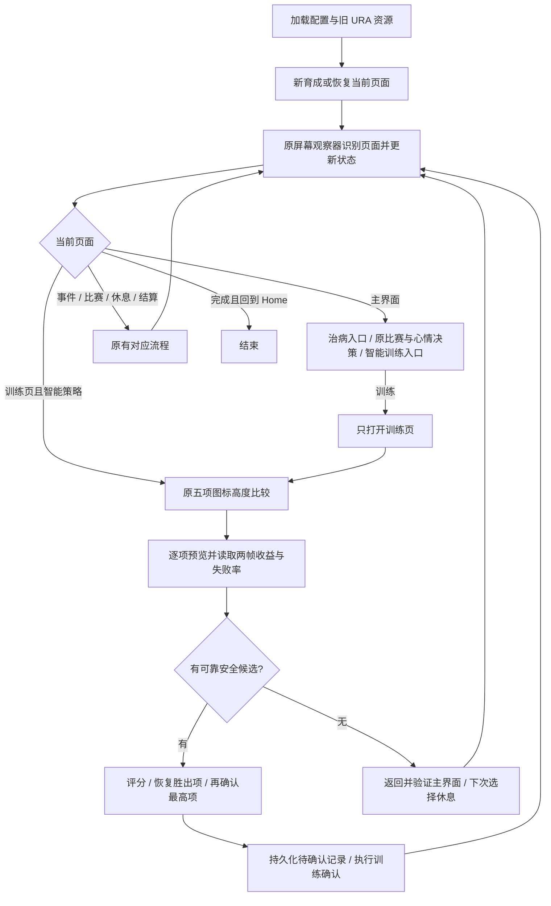

# URA 智能训练：完整运行流程与修复定位

日期：2026-10-06。按当前代码梳理，适用于普通 Career 的 `smart-balanced-safe`。
本文件解释现有实现，不改变策略规则；固定策略、比例策略和 Independent Training 继续走原流程。

## 1. 整体结构



运行循环是“观察页面 → 更新状态 → 分发当前页面动作 → 再观察”，不是预先盲点一串坐标。
打开训练页与真正执行训练是两个独立阶段；切换未选中的训练只用于预览。

## 2. 启动与状态来源

1. 读取角色、支援卡、继承、跑法、技能及策略配置，加载原 URA 页面与 JSON 执行资源。
2. 策略为 smart-balanced-safe 时创建 UraSmartTrainingStrategy，并为评分接入角色赛事数据库的距离查询。
3. 新育成沿用原入口、角色/支援/继承选择和开始确认；继续育成先识别当前检查点，沿用原恢复流程。
4. 继续育成时加载相同设备和角色的智能训练待确认记录；存在记录时恢复确认保护。新育成清除该角色旧记录。
5. 每轮沿用 CareerScreenObserver 与 UraScenarioModule：日期、心情、目标、倒计时使用旧 OCR 和解析器，体力使用旧能量条视觉检测。
6. 角色赛事数据库仅提供评分距离，不替换原 OCR 的目标推进。

关键状态：TurnIndex / TurnPositionLabel、CalendarStage、Energy、Mood、HasPendingRace、CurrentRaceId、ObservedGoalKind。
主界面观察到日期后，原连续比赛逻辑也会判断上一动作是否推进回合。

## 3. 主界面的实际决策顺序

进入主界面动作前，原运行循环先处理尚未结束的动作、事件和目标完成过渡。
CareerTurnFlow 还会等待继承 GO 事件，以及比赛后的目标完成过渡。

正常主界面按以下顺序处理：

1. **识别到可用治病入口**：CareerTurnFlow 直接执行治病入口，不先调用训练评分。
2. **此前五项扫描全部不可用的休息标志**：智能策略消耗 SmartTrainingFallbackPending，选择休息。
3. **原策略决策**：先判断完成状态，再处理待参加的比赛；连续两场比赛时，允许推迟的比赛先安排非比赛回合，必须现在参加的目标赛仍参加。体力低于 50 时直接休息，不进入五项预览，也不因低心情改成外出。体力达到 50 后，普通阶段心情为 Normal 或更低时选择外出；合宿阶段不套用这个普通阶段心情分支。
4. **准备训练时检查体力**：未知、来源 Unknown 或可信度低于 0.70，选择休息。
5. **Classic / Senior 六月下半月且体力低于 80**：选择休息准备合宿。此规则只在原策略本来选择训练时生效，不覆盖已选的比赛或外出。
6. **其他情况**：打开训练页，准备比较五项。智能策略休息阈值为 50；体力低于 50 已直接选择休息，等于 50 则通过这道门槛，仍需满足心情、合宿准备和体力可信度条件。
7. 最终动作必须在当前阶段的可用动作里；不可用则返回失败，不能假装已执行。
8. 休息时，CalendarStage 为 SummerCamp 则调用原合宿休息入口，其余调用普通休息入口。

主界面初次训练 TargetId 通常写 speed，这是打开训练页的占位值。**真正执行哪项由训练页五项评分决定。**
治病与必须参加的比赛保留原优先级；其他普通回合，体力低于 50 直接休息。

## 4. 五项预览与选中状态

### 共用原最高项规则

- 原 Training 标题与原 Back 按钮都匹配，才继续把此页当作可选择的训练页；成功结果页也可能保留 Training 标题。
- 用原五项图标模板，在各自普通与凸起区域的并集里做颜色匹配。
- 五项匹配齐全后，比较图标 CenterY：**CenterY 最小，即画面最高的图标，就是当前选中项。**
- 没有新增各类型的选中模板，不需要先采集五种选中截图。
- 当前 SelectHighest 没有额外高度差门槛；相同高度按匹配列表顺序取第一个。动画中高度判断异常时，应先查五项匹配位置与时序。

### 扫描步骤

扫描顺序：速度 → 耐力 → 力量 → 根性 → 智力。

对每种训练：

1. 首次截图执行原五项高度比较；后续复用上一项第二帧的比较结果。已是目标项则不点击。
2. 不是目标项时，直接点击该比较结果中的目标图标中心，沿用原带日期保护的 TapMatchAsync；智能扫描不再另跑 flat-only ROI 的 preview JSON 匹配。
3. 切换后以 120 ms 间隔截帧、比较五项高度，最多检查三帧；只发一次预览点击。确认目标项最高的这张截图同时作为第一张收益帧。
4. 第一帧读取七个字段；间隔 120 ms 截第二帧，同样比较五项高度。
5. 第二帧按字段检查预处理后的数字图像是否逐像素相同；同一训练项、已知值、图像尺寸和像素全部相同才复用第一帧的 OCR。变化字段重新识别，未知值不复用。
6. 两帧对应字段都已知且相等，才保留稳定值；不一致或任一未知则该字段未知。仍然读取两张真实截图，并核对两帧选中项。
7. 将候选加入本轮列表；核心增益或失败率不可靠时，按运行/类型限额自动留证。

页面已切走就返回原观察循环。初次五项识别失败、预览点击失败、胜出项恢复失败等会返回失败；扫描中部分候选识别不到则排除该候选，仍可比较其他可靠候选。

## 5. 七个数值怎么读取

字段是五项属性增益、技能点增益、失败率。
辅助字段 TrainingLevel / UnbondedSupportCount / HintCount 在当前读取器里保持空。

- 六项增益共用同一属性栏的固定列位置，读取的是显示的“+增长”，不是当前属性总值。
- 失败率共用原纵向 ROI 和宽度，以本帧最高图标的横向中心定位气泡，适配气泡跟随选中项左右移动。
- 增益提取橙色字形连通块，去掉背景和左侧装饰箭头，恢复描边字亮色内部。
- 失败率提取白色或黄色字形，定位百分比所在末行；保留百分号下圆点，排除下方图标碎片。
- 裁剪/缩放、Windows OCR、技能数字解析、原 Tesseract 回退共用既有代码，不新建 OCR 引擎。
- 智能策略将需要识别的数字裁片放在互相隔开的图像行中，合为一次 Windows OCR；按返回文本框所在行归属字段，跨行文本不采用，不按文本返回顺序猜字段。
- 读取顺序：合批 Windows OCR → 共用解析 → 无法可靠解析的字段调用原 Tesseract。第二帧只重新识别像素变化或此前未知的字段。
- 训练使用 2 倍放大；Tesseract 尝试 PSM 7 / 8 / 13。原倒计时仍用自己的 4 倍和 PSM 8 / 13。
- 每项候选两帧、全部字段共用累计 2.5 秒的 **Tesseract 回退预算**，Windows OCR 时间不扣入这个预算；它不是整项扫描的总超时。
- 增益允许 0～999，失败率允许 0～100；增益必须有可辨认的 +（兼容 * / #），失败率必须带 %。负数、多个不同数字、格式破损、越界保持未知。
- 沿用 O/o→0、I/l→1 的纠错。
- 智能快速路径中，收益条确实存在、该列符合原视觉空栏规则、预处理裁片全白时，直接记 0 并跳过 OCR。普通读取路径仍要求 OCR 返回空文本和原空栏证据。OCR 异常或无响应不能直接变 0；失败率空文本也不能变 0%。
- 核心增益可信度与失败率可信度分别计算，评分要求二者都至少 0.80。

本轮候选不会跨回合或跨运行保存。图像识别复用仅在同一候选的第一、第二帧之间启用，下一候选和下一回合第一帧均重新识别。

## 6. 候选过滤与评分

先排除：

- 六项核心增益不完整或可信度低于 0.80。
- 失败率未知、越界或可信度低于 0.80。
- 失败率大于 5%（5% 可用，6% 排除）。
- 加权预计收益为 0。

距离来源：评分专用查询先找当前赛事，否则从已选角色的后续目标链中找可用赛事；查不到再用原 scenario 当前赛事，仍不明则使用中距离权重。该查询不修改目标状态。

| 距离 | 速度 | 耐力 | 力量 | 根性 | 智力 |
|---|---:|---:|---:|---:|---:|
| 短距离 | 1.4 | 0.5 | 1.0 | 0.3 | 0.8 |
| 英里 | 1.4 | 0.8 | 1.0 | 0.3 | 0.8 |
| 中距离 / 未知 | 1.4 | 1.2 | 1.0 | 0.3 | 0.8 |
| 长距离 | 1.4 | 1.6 | 1.0 | 0.3 | 0.8 |

```text
基础分 = (速度增长×速度权重 + 耐力增长×耐力权重
        + 力量增长×1.0 + 根性增长×0.3 + 智力增长×0.8
        + 技能点增长×0.5) × (1 - 失败率/100)

正常训练最终分 = 基础分
体力 < 50：主界面直接休息，不进入五项评分
```

权重、5% 门槛和体力 50 门槛目前在代码中定义，没有新增界面调参项。本版按当回合显示收益评分，没有再根据当前属性短板、属性封顶或未来多个回合做额外优化。评分接口原低体力智力 +15 暂保留兼容，但正常主界面流程已在低于 50 时休息，不触发该分支。

评分器保留羁绊与 Hint 的可选加分结构，但本版读取器返回空，因此运行中的两项加分为 0。
友情等提高的实际收益已经体现在“+增长”里，本版不再根据彩圈重复加分。

先取最终分最高者；同分取失败率更低者；仍相同则按速度 → 耐力 → 力量 → 智力 → 根性。
注意：这个同分顺序与五项扫描顺序不同。

例：中距离，速度候选 +20 速度 / +9 力量 / +5 技能点 / 0%，分数为 39.5；
智力候选 +4 速度 / +12 智力 / +5 技能点 / 0%，基础分 17.7。上述比较用于体力达到 50 且其他主界面条件允许训练时；体力 40 则直接休息，不进行这组比较。

## 7. 胜出项、休息与确认保护

### 有胜出项

1. 新帧比较五项高度，检查当前选中。
2. 当前不是胜出项时，使用与扫描相同的已验证图标位置切换及三帧有界检查，再验证最高项。
3. 验证成功后设置 PendingTrainingType，标记训练动作并准备原目标完成探测。
4. **真正确认前**设置 TrainingTurnCommitPending / Type / TurnIndex，将待确认记录持久化到磁盘。
5. 角色身份缺失或记录保存失败时，不发送训练确认。
6. 原执行器再次检查最高项。胜出项已经选中时，从旧 raised_probe / raised_click 链进入真正执行训练的点击。
7. JSON 任务成功返回后设置 TrainingClickIssuedType；后续仍见训练页时只等待，不扫描、不再确认。页面切换交回原观察循环。

“单次确认”指消费回合的训练确认；预览切换点击不计入确认次数。
确认前后依然存在观察、输入和游戏动画的时序，需设备运行验收。

### 无可用候选

1. 标记 SmartTrainingFallbackPending，清空胜出项。
2. 点击原 Back，最多五次以 180 ms 间隔检查主界面模板。
3. 主界面确实出现后，下一次主界面决策消耗该标志，选择普通或合宿休息。
4. Back 后未验证到主界面就返回失败，不能假装已休息。

### 已提交动作的结果与恢复

持久化文件：`%LOCALAPPDATA%/UmamusumeAss/debug/hachimi/career/smart-training-pending-<设备与角色摘要>.json`。
身份由 AndroidId、Serial、TraineeId 组成；记录角色、训练类型、提交回合和时间，不保存候选分数。

- 当前运行 TrainingClickIssuedType 已有值：不发第二次确认。
- 重启/继续育成加载到待确认记录，又遇到训练页：返回“上次确认结果未知”的失败，不重新扫描确认。
- 看见 training_result，或主界面满足当前提交完成判断时，清除内存确认标志，调用策略 ConfirmTraining 清空候选；运行循环随后清除磁盘记录。
- 当前主界面完成判断是 `PendingTurnAction != Training && (TurnIndex > 提交回合 || (TurnIndex == 提交回合 && 日期来源 == Observed))`。等回合分支用于支持原流程恢复，排查重复点击时须同时核对 PendingTurnAction / 日期来源，不能概括为“日期增加才清除”。
- 原连续比赛逻辑在出道前日期索引恒为 0 时，还会结合目标倒计时减少一回合判断动作推进。
- 记录损坏或不可读取会报错；不能当作“没有记录”继续。

## 8. 训练以外的流程

比赛选择、跑法、比赛执行、重试闹钟、事件选项、继承 GO、外出、治病、普通/合宿休息、技能学习及育成结算，继续由原模块处理。
智能评分只替换普通训练页选择项目的部分，不接管上述模块。
动作后的事件与 GOAL 页面仍先走原过渡流程，再开始下一回合。结算完成返回 Home 后结束并处理原技能缓存。

未知页面沿用原稳定识别重试与诊断；重试耗尽或动作失败时返回失败/暂停。
日期变化中断沿用原日期恢复机制，智能流程不吞掉这类异常。

## 9. 日志与修复入口

每项候选的日志含六项增长、失败率、距离、基础分、低体力智力加分、最终分或排除理由。
Hachimi 前端另以单条“智能训练扫描”日志卡显示本轮五项训练的全部六项增长、失败率、评分、排除原因和最终选择，并标注日期与体力。未知值仍显示未知；胜出项在确认前标为“待确认”。该卡直接使用本轮扫描及评分结果，不额外截图或 OCR；原逐项详细诊断日志保留。
选中确认日志可见 Raised training item 及五项 y / 匹配分数。
没有安全候选时有明确休息回退日志；上次确认结果未知有独立失败信息。

字段未知或双帧不稳定时，已有帧保存到：

```text
%LOCALAPPDATA%/UmamusumeAss/debug/hachimi/career/
  smart-training-<运行时间与摘要>/<训练类型>/
    sample-1.png
    sample-2.png
    recognition.json
```

每次运行每种训练最多保存首次异常。高失败率本身不会触发“识别异常”留证；识别正确时在候选日志中记录排除。
JSON 包含日期/回合、两帧候选、合并值及字段识别证据。RawText 是 Windows OCR 文本；Tesseract 回退记录结果和来源，未保存其原始 stdout。
初次无法识别五项或没有截到帧时，不一定有这组双帧文件，先查原页面诊断与日志。

| 症状 | 先看什么 | 修复入口 |
|---|---|---|
| 日期、心情、目标、体力不对 | 主界面观察值、状态来源/可信度、原页面诊断 | [CareerScreenObserver](C:/Users/Owner/Documents/teiocode/UmamusumeAss/UmamusumeAss/src/UmamusumeWpfGui/Services/Training/Runtime/CareerScreenObserver.cs) / [UraScenarioModule](C:/Users/Owner/Documents/teiocode/UmamusumeAss/UmamusumeAss/src/UmamusumeWpfGui/Services/Training/Scenarios/Ura/UraScenarioModule.cs) |
| 不该外出/休息/比赛却选了 | 高优先级分支、CalendarStage、SmartTrainingFallbackPending | [旧 UraDefaultStrategy](C:/Users/Owner/Documents/teiocode/UmamusumeAss/UmamusumeAss/src/UmamusumeWpfGui/Services/Training/Normal/SimpleNormalTrainingStrategy.cs) / [智能策略](C:/Users/Owner/Documents/teiocode/UmamusumeAss/UmamusumeAss/src/UmamusumeWpfGui/Services/Training/Normal/UraSmartTrainingStrategy.cs) / [CareerTurnFlow](C:/Users/Owner/Documents/teiocode/UmamusumeAss/UmamusumeAss/src/UmamusumeWpfGui/Services/Training/Runtime/Flows/CareerTurnFlow.cs) |
| 选中判断或切换错误 | 五个图标的 CenterY / 分数、是否仍在训练页、点击时序 | [高度检测](C:/Users/Owner/Documents/teiocode/UmamusumeAss/UmamusumeAss/src/UmamusumeWpfGui/Services/Training/Runtime/UraTrainingSelectionHeightDetector.cs) / [智能训练流程](C:/Users/Owner/Documents/teiocode/UmamusumeAss/UmamusumeAss/src/UmamusumeWpfGui/Services/Training/Runtime/UraSmartTrainingSelectionFlow.cs) |
| 增益或失败率未知/错误 | 双帧、ROI、原始文本、Source、回退预算 | [数值预处理](C:/Users/Owner/Documents/teiocode/UmamusumeAss/UmamusumeAss/src/UmamusumeWpfGui/Services/Training/Runtime/UraTrainingNumberImagePreprocessor.cs) / [共用数字解析](C:/Users/Owner/Documents/teiocode/UmamusumeAss/UmamusumeAss/src/UmamusumeWpfGui/Services/Training/Runtime/CareerOcrNumberParser.cs) / [ROI 配置](C:/Users/Owner/Documents/teiocode/UmamusumeAss/UmamusumeAss/resource/hachimi/career/turn/profile.json) |
| 分数或胜出项不对 | distance、各项增长、exclusion、witLowEnergy、同分规则 | [UraSmartTrainingScorer 与距离查询](C:/Users/Owner/Documents/teiocode/UmamusumeAss/UmamusumeAss/src/UmamusumeWpfGui/Services/Training/Normal/UraSmartTrainingStrategy.cs) |
| 点击重复或恢复后停住 | TrainingClickIssuedType、CommitPending、PendingTurnAction、磁盘待确认记录 | [动作执行与确认](C:/Users/Owner/Documents/teiocode/UmamusumeAss/UmamusumeAss/src/UmamusumeWpfGui/Services/Training/Runtime/CareerFlowDispatcher.cs) / [结果提交](C:/Users/Owner/Documents/teiocode/UmamusumeAss/UmamusumeAss/src/UmamusumeWpfGui/Services/Training/Runtime/CareerTrainingEngine.cs) / [确认记录](C:/Users/Owner/Documents/teiocode/UmamusumeAss/UmamusumeAss/src/UmamusumeWpfGui/Services/Training/Runtime/UraSmartTrainingConfirmationStore.cs) |
| 预览耗时长、第二帧大量未知 | Smart preview / scan / decision timing 中的 elapsedMs、captures、windowsOcr、fallbackOcr、stableReuse；2.5 秒回退预算 | [智能采样](C:/Users/Owner/Documents/teiocode/UmamusumeAss/UmamusumeAss/src/UmamusumeWpfGui/Services/Training/Runtime/UraSmartTrainingPreviewSampler.cs) / [智能 OCR 合批](C:/Users/Owner/Documents/teiocode/UmamusumeAss/UmamusumeAss/src/UmamusumeWpfGui/Services/Training/Runtime/UraSmartTrainingOcrBatch.cs) / [共用 Tesseract](C:/Users/Owner/Documents/teiocode/UmamusumeAss/UmamusumeAss/src/UmamusumeWpfGui/Services/Training/Runtime/CareerNumericOcrReader.cs) |
| 模板点击找不到 | JSON 任务名、搜索区域、旧图标模板、点击后的完成检测 | [训练任务配置](C:/Users/Owner/Documents/teiocode/UmamusumeAss/UmamusumeAss/resource/hachimi/career/training/execution.json) |

排查顺序：先确定页面与回合 → 再核对选中项 → 再核对两帧字段 → 再核对过滤/分数 → 最后检查点击与提交记录。
不要用修改权重掩盖识别错误，也不要把显示未知的字段直接补成 0。

## 10. 已验证与尚未验收

- Release 构建通过，0 警告、0 错误。
- 性能修订后 223 项相关回归通过，0 跳过；包含旧固定/比例策略、共享 OCR、点击保护、预览动画有界检查与第二帧数字变化/未知值处理。
- 9 张真实截图同时通过原读取路径和智能合批路径，含耐力 92%、速度 28% / 95%、合宿与箭头装饰；独立第二帧缓冲区的相同数字图像复用七个已知字段，不调用 Windows OCR 或 Tesseract。
- 正常速度已选中起始、每次切换一次即可验证的扫描测试为 10 张截图、4 次预览点击；恢复胜出项和原最终确认另计。动画未完成时最多检查三帧，不再次点击。
- 离线截图记录：首次读取约 0.65～1.22 秒，相同数字图像的第二帧检查约 2～5 毫秒；不包含 ADB 截图、五项模板比较、点击及游戏动画，不能作为整回合耗时。
- 本次仅修改智能训练专用源文件及对应测试/文档；264 个非智能策略源文件的修订前后 SHA256 一致。
- 这些是相关回归和离线截图验证，不代表完整测试套件或五种设备预览全部实跑通过。
- 待验收：新版连接模拟器、一轮完整五项扫描/恢复胜出项/单次确认/回退与中断、完整 URA 育成。
- 当前没有必交采集素材。出现实际异常先使用程序自动留证。
